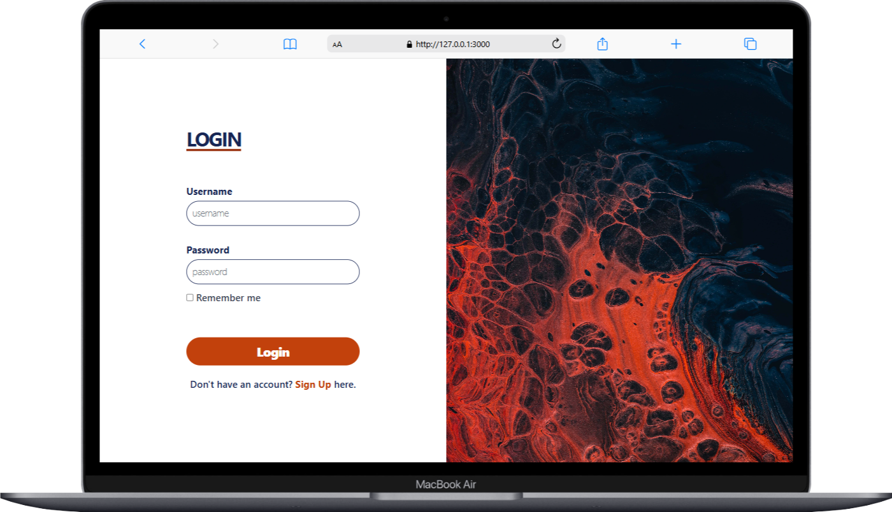

# HTML Login and Signup Page using Tailwind CSS  

This repository contains a simple and responsive Login and Signup page designed using **Tailwind CSS**. The pages are styled to provide a modern and user-friendly interface.  

## Features  
- **Responsive Design**: Optimized for all devices, including mobile, tablet, and desktop.  
- **Clean Layout**: Simple and minimalistic design for better user experience.  
- **Tailwind CSS**: Fully customizable and easy to extend.  

## Screenshots  

### Login Page  (Mobile Devices)


### Signup Page  (Mobile Devices) 
  
 
### Login Page  (Desktop)


### Signup Page  (Desktop) 


## Technologies Used  
- **HTML5**  
- **Tailwind CSS**  

## Installation  
1. Clone the repository:  
   ```bash  
   git clone https://github.com/itz-me-debangshu/login-signup-page-using-TailwindCSS.git
   ```

2. Navigate to the `src` folder:
   ```bash
   cd src
   ```

3. Open `index.html` in your favorite browser to view the pages.

## How to use
- **Download or clone the repository.**
- **Customize the HTML and Tailwind classes as needed.**
- **Use it as a starting point for your projects.**

## Contributions
Feel free to submit issues and feature requests. Contributions are always welcome!

## License
This project is licensed under the MIT License.

## Author
Created by Debangshu.

## Links
- **GitHub Repository:**
```bash
https://github.com/itz-me-debangshu/login-signup-page-using-TailwindCSS
```
